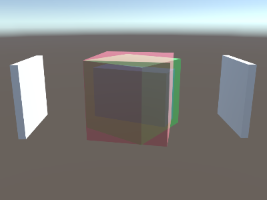

# Order-independent Transparency in Unity

---

Both images show three stacked transparent cubes. The first one with this implementation of order-independent transparency and correct color blending. The second one is rendered with the standard shader.

## Description

This is an implementation of order-independent transparency in Unity's **Built-In Pipeline**. It uses Per-Pixel Linked Lists, implemented with RWStructuredBuffers.
This is a feature requiring Shader Model 5.0 with ComputeBuffers, see the [Unity Manual](https://docs.unity3d.com/Manual/SL-ShaderCompileTargets.html) for supported platforms.
For reference a [presentation by Holger Gruen and Nicolas Thibieroz](https://de.slideshare.net/hgruen/oit-and-indirect-illumination-using-dx11-linked-lists)
was used. The code is based on their suggestions.

## Usage

I recommend using this with the package Post-Processing Stack v2, because then transparent objects will be rendered in Scene View as well. Follow these steps:

1. Add the post-processing override `Order Independent Transparency` to a post-processing volume in your scene.
2. Change the shaders of every object that shall be rendered with order-independent transparency. They have to have a material using a custom shader. Two sample shaders that you can use are included in this project `OrderIndependentTransparency/Unlit` and `OrderIndependentTransparency/Standard` (standard shader has to be set to Rendering Mode Transparent).
3. Run your scene.

### Without Post-Processing Stack v2

If you don't want to use the post-processing stack just skip the first step and instead add the component `OitCameraComponent` to a camera. Transparent objects won't render in the editor scene view using this component.

## Notes

- Other platforms than Windows might not work as expected as this is using more unconventianol HLSL features. Let me know of your experience and if you got this running on different platforms.
- Note that this project currently does **not** include implementations for the Universal Render-Pipeline and the High-Definition Render-Pipeline.

## References

- https://github.com/GameTechDev/AOIT-Update
- https://de.slideshare.net/hgruen/oit-and-indirect-illumination-using-dx11-linked-lists
- Salvi, Marco, and Karthik Vaidyanathan, "Multi-layer Alpha Blending", in Proceedings of the 18th ACM SIGGRAPH Symposium on Interactive 3D Graphics and Games, ACM, pp. 151-158, 2014. https://www.intel.com/content/www/us/en/developer/articles/technical/multi-layer-alpha-blending.html
- Real-Time Rendering, Fourth Edition, by Tomas Akenine-Möller, Eric Haines, Naty Hoffman, Angelo Pesce, Michał Iwanicki, and Sébastien Hillaire, 1198 pages, from A K Peters/CRC Press, ISBN-13: 978-1138627000, ISBN-10: 1138627003 http://www.realtimerendering.com/
